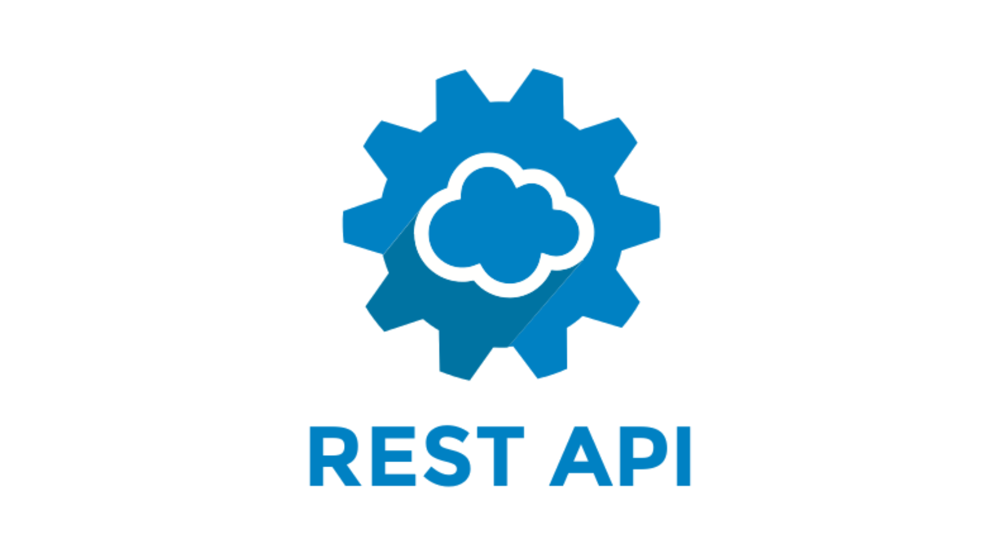

<p align="center">
  <a href="#" target="blank"></a>
</p>

<p align="center">
  <strong>SocialMedia Backend</strong> – A combination of REST & GraphQL API built with <a href="http://nestjs.com/" target="_blank">NestJS</a>.
</p>

<p align="center">
  <a href="https://www.npmjs.com/~nestjscore" target="_blank"></a>
  <a href="https://www.npmjs.com/~nestjscore" target="_blank"></a>
  <a href="https://www.npmjs.com/~nestjscore" target="_blank"></a>
  <a href="https://discord.gg/G7Qnnhy" target="_blank"></a>
</p>

---

## Project Description

This project is a **full-featured backend** for managing social media posts and schedules.
It combines **REST APIs** for simple CRUD operations and **GraphQL APIs** for flexible queries and mutations.
Built using **NestJS**, **MongoDB**, and TypeScript, it demonstrates modern backend architecture.

---

## Features

- Create, update, delete posts via REST and GraphQL
- Schedule posts for different platforms
- User authentication & authorization
- Real-time status tracking of posts
- Clean modular architecture (modules, services, controllers, resolvers)

---

## Project Setup

```bash
# Install dependencies
$ yarn install
```

## Running the Project

```bash
# Development
$ yarn start:dev

# Production
$ yarn start:prod
```

---

## API Overview

### REST



<!-- Replace with your REST API diagram -->

### GraphQL


<!-- Replace with your GraphQL API diagram -->

---

## Testing

```bash
# Unit tests
$ yarn test

# E2E tests
$ yarn test:e2e

# Test coverage
$ yarn test:cov
```

---

## Deployment

Check the [NestJS Deployment Guide](https://docs.nestjs.com/deployment) for instructions.
Optionally, you can deploy to cloud platforms such as **AWS**, **Docker**, or **Heroku**.

---

## Resources

- [NestJS Documentation](https://docs.nestjs.com)
- [NestJS DevTools](https://devtools.nestjs.com)
- [Discord Channel](https://discord.gg/G7Qnnhy)
- [Video Courses](https://courses.nestjs.com/)

---

## Author

- **Hoàng “Lenf”** – Full-stack developer, combining REST & GraphQL APIs

---

## License

MIT
